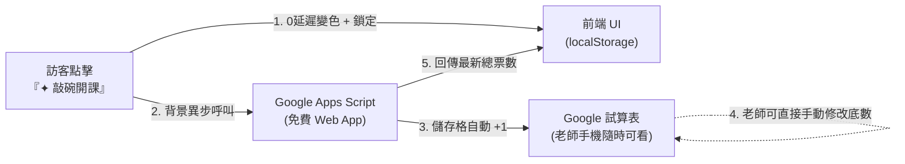

# 星靈織語 Starwoven — 課程敲碗清單（Course Wishlist）功能規劃企劃書

> **文件狀態**：規劃中草案（v1.0）  
> **建立日期**：2026-10-01  
> **預計實施階段**：功能擴充期（完工驗收後整合至 `spec.md` 與 `decisions.md`）  
> **核心設計原則**：零填表摩擦力、極致非工程師友善、純靜態安全架構、即時變色回饋。

---

## 一、 背景與需求痛點

### 1. 現狀與機會
星靈織語目前提供多門常態與進階課程（如托特塔羅、偉特塔羅、光與阿卡西、臼井靈氣、占星、生命靈數）。然而，部分高階進階課或特殊主題工作坊（例如「托特高階解盤專題」、「阿卡西靈魂藍圖深度工作坊」）若未達一定人數，冒然排班容易造成師資與場地成本浪費。

### 2. 為什麼捨棄「傳統表單（姓名/電話/Email）」？
- **心理阻力極大**：身心靈探索用戶極重隱私與心境感受，要求填寫表單會使 80% 以上僅抱持「好奇、有點感興趣」的潛在學員直接跳離。
- **解決方案**：採**「一鍵輕量敲碗（+1）」**，訪客無需登入、無需留個資，點擊即算一票，最大化收集群眾興趣度。

---

## 二、 總體技術架構：為什麼選「Google Sheets + Apps Script」？

本專案全站為 **Astro 5 純靜態網站（Pure Static SSG）**，無常駐後端伺服器（Node.js / Express）。



### 架構優勢
1. **極致安全（零金鑰洩漏風險）**：
   - 相較於 Notion API 需要在前端暴露具備最高權限的 `secret_token`，Google Apps Script 部署為公開 Web App，訪客端**不需要任何密碼或 API Key**。
2. **免架伺服器（零主機維護成本）**：
   - Hetzner VPS 維持最純粹的 Nginx 靜態伺服器，不需要開額外後端進程或處理反向代理。
3. **對非工程師業主 100% 友善**：
   - 老師們隨時用手機 App 打開 Google 試算表即可掌握即時敲碗人數。
   - **支援手動補底數**：新課程上架怕「0 人敲碗」尷尬，老師可在試算表手動將數值改成 `5`，網頁端立刻呈現「已有 5 人期待」，輕鬆帶動從眾效應。

---

## 三、 使用者體驗與互動細節設計（UX Specification）

### 1. 按鈕狀態流轉（State Machine）

| 狀態 | 按鈕外觀視覺 | 按鈕文案 | 行為與邏輯 |
| :--- | :--- | :--- | :--- |
| **State 1：未敲碗（預設）** | 半透明玻璃質感、細緻金邊微光、滑鼠懸停微放大 | `✦ 敲碗開課` | 可點擊，右側或下方顯示目前累積票數（如 `🔥 12 人期待`） |
| **State 2：點擊瞬間（樂觀更新）** | 數字立即由 `12` 跳為 `13`（微縮放彈跳動畫） | 轉為微光粒子效果 | 暫時鎖定按鈕避免連擊，啟動 8 秒逾時控制器（`AbortController`），背景非同步呼叫 Apps Script API |
| **State 3：成功敲碗（永久鎖定）** | 按鈕切換為**金色光芒實心底色（`bg-[#FCE794]`）**、深色文字 | `✓ 已成功敲碗` | 狀態設為 `disabled`，正式寫入 `localStorage`，持久化鎖定 |
| **State 2b：失敗回滾（Rollback & 可重試）** | 按鈕短暫浮現琥珀紅微警示邊框 | `連線稍候，點此重試` | **數值自動回退**（由 `13` 倒退回 `12`），**解除鎖定**且**不寫入 localStorage**。2 秒後平滑恢復為 State 1，允許使用者重新點擊 |

### 2. 降低重複點擊與防暴衝機制（Anti-Spam & Velocity Control）

> **業務定位宣告**：本功能定位為「市場開課意向熱度參考（Interest Indicator）」，並非嚴肅公投或高規格身分認證系統。其設計目標在於**降低一般訪客無心的重複點擊、阻擋簡單迴圈腳本短時間暴衝，並確保高併發時試算表資料不損壞**。若日後真遇異常數據，業主隨時可在試算表後台手動校正或重設。

- **前端層（Client Layer）**：
  - 訪客首次造訪時生成持久化裝置識別碼 `client_id`（標準 UUIDv4 格式，長度約 36 字元，存於 `localStorage`）。
  - 成功敲碗後於 `localStorage` 記錄 `starwoven_wish_{course_id} = true`，使常態造訪完全無法重複點擊。
- **伺服器層（Server Layer）**：
  1. **`client_id` 安全格式與長度檢核（防程式異常）**：
     - Apps Script 驗證 `client_id` 長度不超過 64 字元且僅含安全字元（`^[a-zA-Z0-9\-_]+$`），避免惡意超長字串造成 `CacheService.put()` 拋出例外，確保程式穩定運作。
  2. **排他鎖內快取檢查（降低同一裝置平行重複計票）**：
     - 將「檢查快取、頻率驗證、試算表寫入、設定快取」全部放入 `LockService.tryLock()` 內執行，避免並發請求同時穿透快取。
  3. **滑動視窗防暴衝保護（保護閥門）**：
     - Apps Script 於鎖內維護課程滑動視窗：單一課程每 10 秒上限 10 票（寬容設計，避免社群貼文發布、大量真實學員同時導流時被誤擋）。超過頻率回傳 `RATE_LIMITED`，阻止暴力腳本短時間灌爆試算表。

---

## 四、 Google Sheets 試算表結構與 Apps Script 規格

### 1. Google 試算表欄位規劃（範例工作表名：`Wishlist`）

為了徹底解決「並發覆寫」以及「業主手動調整底數被投票程式覆蓋」之問題，將底數與真實票數徹底解耦：

| A 欄（course_id） | B 欄（course_name） | C 欄（base_votes） | D 欄（real_votes） | E 欄（total_votes） | F 欄（target_threshold） | G 欄（status） |
| :--- | :--- | :--- | :--- | :--- | :--- | :--- |
| `thoth_advanced` | 托特塔羅高階班 | 5 | 11 | `=C2+D2` | 15 | `達標籌備中` |
| `akashic_deep` | 阿卡西靈魂藍圖深度工作坊 | 3 | 5 | `=C3+D3` | 10 | `敲碗募集中` |
| `reiki_master` | 臼井靈氣三階大師班 | 0 | 4 | `=C4+D4` | 8 | `敲碗募集中` |

- **C 欄（`base_votes`）**：**業主專用調整欄**，老師可隨時在手機手動設定初始底數（例如 `5`）。
- **D 欄（`real_votes`）**：**程式真實計數欄**，Apps Script 的投票累加操作**永遠只修改 D 欄**，絕對不碰 C 欄，杜絕覆寫問題。
- **E 欄（`total_votes`）**：對外展示之總票數，由試算表公式 `=C2+D2` 或 API 即時動態計算回傳。

### 2. Google Apps Script 程式碼範本（支援 tryLock 排他鎖、鎖內快取與防暴衝限速）

```javascript
/**
 * 星靈織語 Starwoven — 課程敲碗清單 Google Apps Script 核心處理端（高可靠並發與防暴衝版）
 */
function doGet(e) {
  var action = e.parameter.action;
  var courseId = e.parameter.course_id;
  var clientId = e.parameter.client_id;
  var sheet = SpreadsheetApp.getActiveSpreadsheet().getSheetByName("Wishlist");
  var cache = CacheService.getScriptCache();
  
  // 1. 取得全站各課程當前敲碗票數（含底數加總）
  if (action === "get_all") {
    var data = sheet.getDataRange().getValues();
    var result = {};
    for (var i = 1; i < data.length; i++) {
      var cId = data[i][0];
      var base = Number(data[i][2]) || 0;
      var real = Number(data[i][3]) || 0;
      result[cId] = {
        name: data[i][1],
        base_votes: base,
        real_votes: real,
        total_votes: base + real,
        threshold: data[i][5],
        status: data[i][6]
      };
    }
    return ContentService.createTextOutput(JSON.stringify({ status: "success", data: result }))
      .setMimeType(ContentService.MimeType.JSON);
  }
  
  // 2. 進行單一課程敲碗投票 (+1，全流程由排他鎖保護)
  if (action === "vote" && courseId) {
    // 2.1 驗證 client_id 格式與長度（長度 <= 64，避免 Cache key 過長造成寫入例外）
    if (!clientId || clientId.length > 64 || !/^[a-zA-Z0-9\-_]+$/.test(clientId)) {
      return ContentService.createTextOutput(JSON.stringify({ 
        status: "error", 
        code: "INVALID_CLIENT_ID", 
        message: "訪客裝置識別碼無效" 
      })).setMimeType(ContentService.MimeType.JSON);
    }

    // 2.2 獲取排他鎖（使用 tryLock 正確取得布林回傳值）
    var lock = LockService.getScriptLock();
    try {
      var hasLock = lock.tryLock(10000); // 最多等待 10 秒
      if (!hasLock) {
        return ContentService.createTextOutput(JSON.stringify({ 
          status: "error", 
          code: "SERVER_BUSY", 
          message: "伺服器忙碌中，請稍候重試" 
        })).setMimeType(ContentService.MimeType.JSON);
      }

      // 2.3 【鎖內檢查 1】設備防重複點擊快取（同一 client_id 於鎖內徹底排他）
      var cacheKey = "voted_" + courseId + "_" + clientId;
      if (cache.get(cacheKey)) {
        return ContentService.createTextOutput(JSON.stringify({ 
          status: "already_voted", 
          message: "您已經為此課程敲過碗囉！" 
        })).setMimeType(ContentService.MimeType.JSON);
      }

      // 2.4 【鎖內檢查 2】全域滑動視窗防暴衝（單課 10 秒上限 10 票，避免社群真實導流時被誤擋）
      var rateKey = "rate_limit_" + courseId;
      var currentRate = Number(cache.get(rateKey)) || 0;
      if (currentRate >= 10) {
        return ContentService.createTextOutput(JSON.stringify({ 
          status: "error", 
          code: "RATE_LIMITED", 
          message: "當前敲碗人數熱烈，系統保護中，請稍候 10 秒再試！" 
        })).setMimeType(ContentService.MimeType.JSON);
      }

      // 2.5 執行試算表寫入
      var data = sheet.getDataRange().getValues();
      for (var i = 1; i < data.length; i++) {
        if (data[i][0] === courseId) {
          var rowIndex = i + 1;
          var baseVotes = Number(data[i][2]) || 0;
          // 重新讀取最新的真實票數
          var currentRealVotes = Number(sheet.getRange(rowIndex, 4).getValue()) || 0;
          var newRealVotes = currentRealVotes + 1;
          
          // 只更新 D 欄（real_votes），絕不覆蓋業主設定之 C 欄底數
          sheet.getRange(rowIndex, 4).setValue(newRealVotes);
          SpreadsheetApp.flush(); // 強制即刻寫入試算表
          
          // 寫入快取保護
          cache.put(cacheKey, "true", 21600); // 該裝置 6 小時內不重複累加
          cache.put(rateKey, String(currentRate + 1), 10); // 10 秒滑動視窗計數

          return ContentService.createTextOutput(JSON.stringify({ 
            status: "success", 
            course_id: courseId, 
            votes: baseVotes + newRealVotes 
          })).setMimeType(ContentService.MimeType.JSON);
        }
      }

      return ContentService.createTextOutput(JSON.stringify({ status: "error", message: "找不到指定課程" }))
        .setMimeType(ContentService.MimeType.JSON);

    } catch (err) {
      return ContentService.createTextOutput(JSON.stringify({ status: "error", message: err.toString() }))
        .setMimeType(ContentService.MimeType.JSON);
    } finally {
      lock.releaseLock();
    }
  }

  return ContentService.createTextOutput(JSON.stringify({ status: "invalid_action" }))
    .setMimeType(ContentService.MimeType.JSON);
}
```

---

## 五、 前端實施步驟與驗收清單

後續開始動工時，按以下 5 個步驟執行：

- [ ] **Step 1：建立 Google 試算表與部署 Apps Script**
  - 由業主或開發者在 Google 雲端建立試算表，貼上上述具備 LockService 與 CacheService 之 Apps Script。
  - 點擊「部署 ➔ 新增部署作業 ➔ 網頁應用程式」，設定「執行身分：我」、「誰可以存取：任何人」。
  - 取得專屬 Web App URL（形如 `https://script.google.com/macros/s/XXX/exec`）。
- [ ] **Step 2：環境變數配置**
  - 在 `.env` 與 `.env.example` 新增 `PUBLIC_WISHLIST_API_URL`。
- [ ] **Step 3：前端元件開發 (`src/components/CourseWishlistCard.astro`)**
  - 刻劃敲碗卡片（封面圖、課程名稱、講師、募集中標籤、進度條、敲碗按鈕）。
  - 適配 Dark / Light Mode 與粉圓體字型。
- [ ] **Step 4：客戶端防刷、裝置識別碼與錯誤回滾實作**
  - 於 `localStorage` 自動生成持久化 `starwoven_client_id`。
  - 撰寫樂觀更新與 `AbortController` 8 秒逾時斷開。
  - 實作完整 `try...catch` 錯誤捕捉：若 API 失敗或超時，自動回滾票數並提示重新嘗試，絕不造成狀態死鎖。
- [ ] **Step 5：整合與文件驗收**
  - 於 `/courses` 活動與課程頁面下方新增「✦ 意向募集・熱烈敲碗中」區塊。
  - 驗收並發點擊測試、防刷阻擋與錯誤回滾機制。
  - 將成果正式登錄於 `spec.md` 與 `decisions.md`。

---

## 六、 結論與建議

本方案兼顧了**極低開發成本**、**極致業主友善性**與**頂級學員互動體驗**。後續等團隊開會定案欲開放敲碗的課程清單後，即可隨時依循本文件無痛推進實作！
